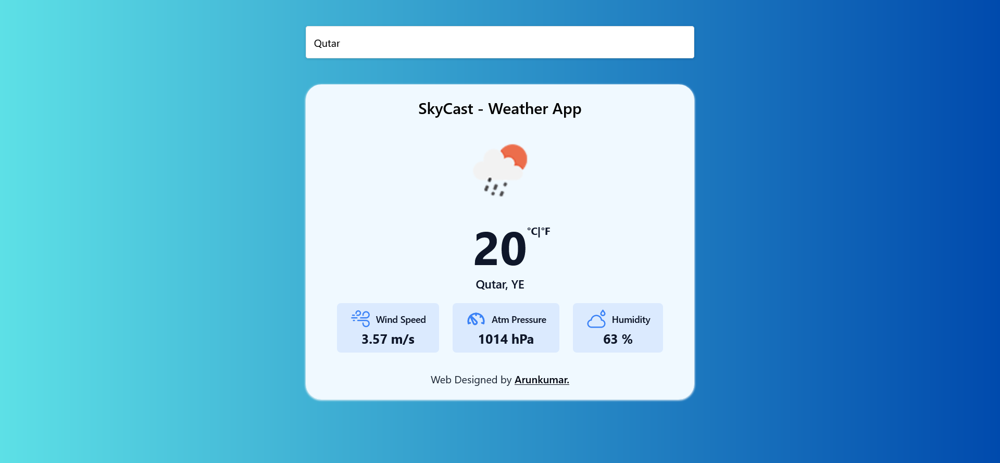

# SkyCast - Weather React App

SkyCast is a handy weather app made using React and Tailwind CSS. It helps you easily check the forecast with its simple and cool design.

__live:__ https://er-arunkumarselvam.github.io/SkyCast/

__ScreenShot:__

__Reference:__

- [Openweathermap API](https://openweathermap.org/)

__Author__
    
- [Arunkumar](https://github.com/er-arunkumarselvam)